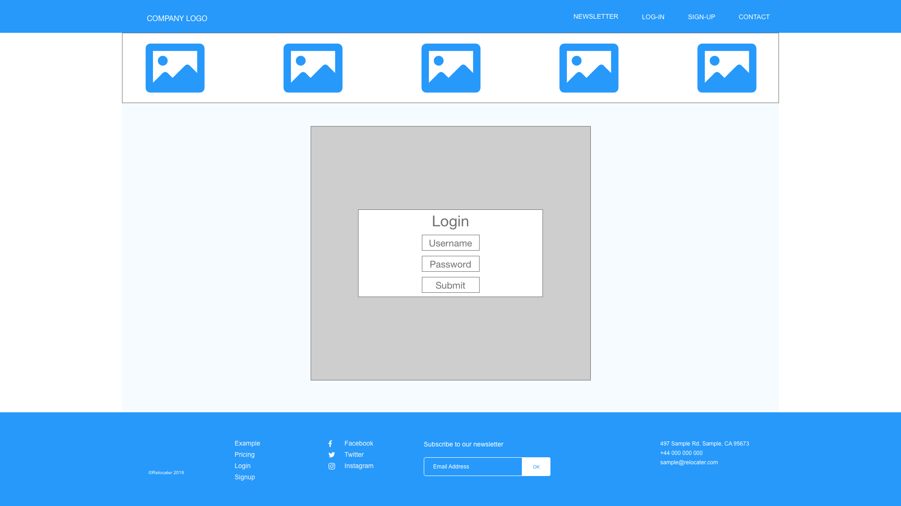
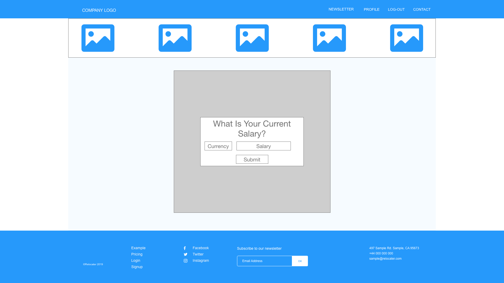
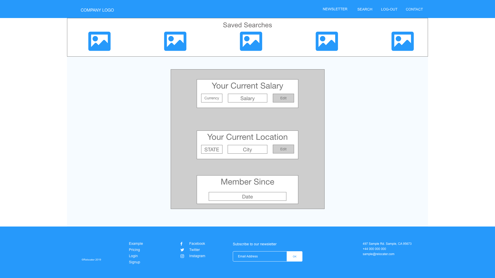
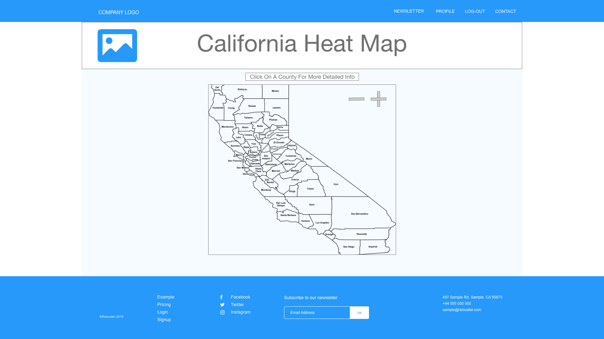
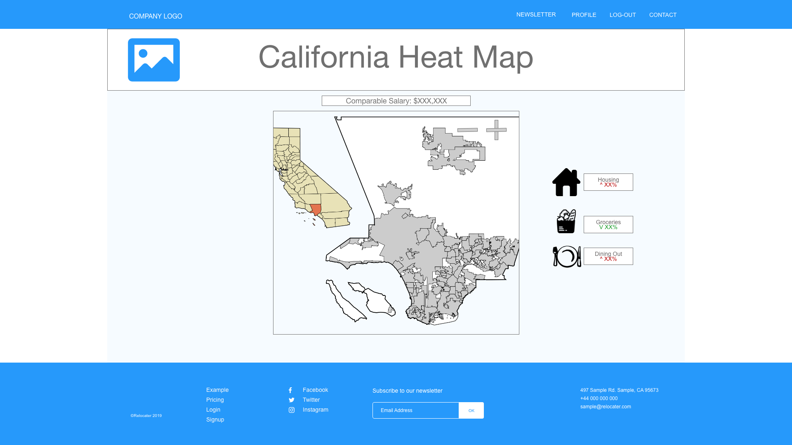

# Relocater 


## A. Description
Relocater is a single-page CRUD app that *caters* to a user's relocation needs.  The app determines what salary he/she/they/zhe needs to make in order to maintain the same lifestyle in a new county. The calculation is based on the user's current salary, current county's median income, and selected county's median income.

```
Relocater was built in 5 days by:
Bryant Cabrera - GitLab Manager/Scrum Master/Documenter
Kevin Cuison - Scrum Master/Designer
Peter Feinman - Data Visualization/Database Manager
Ummer Khan - Database Manager/API Manager & Creator/Designer
```

## B. Images
1. Wireframe
    > 
    > 
    > 
    > 
    > 
    > 
    > 
2. 


## C. Technologies Used
> Front-End
    
    1. React
    2. BEM
    3. Google fonts
    4. flaticon.com

> Back-End

    1. node
    2. express
    3. mongoose
    4. mongoDB
    5. axios
    6. xml2json

> APIs
    
    1. socrata
    2. zillow
    3. bestplaces.net

> Data Visualization
  
    1. d3-geo
    2. topo-json-client
    3. recharts

> Authentication
    
    1. passport
    2. google OAuth 2
    3. sockets
    4. bcrypt

> Planning/Organization
    
    1. Adobe XD
    2. Adobe Photoshop
    3. trello


## D. Getting Started
1. LOGGING IN: At the top center, toggle between Sign Up & Sign In.
    1. If you click Sign Up, you can create a new account. 
        1.  Enter your email address and password.
        2.  You will then be redirected to your profile page where you can enter your salary and choose the county you currently live in.
    2. If you click Sign In, you can log into your account using your Relocater account or your Google account.
        1.  If signing in with your Relocater account, just enter your email and password.
        2.  If signing in with your Google account, a popup will let you choose which Google account you want to sign in with.
2.  Soon after, you will be redirected to a map of California where you can hover and click on the county you are interested in moving to.  The opacity is a normalized value that increases with increasing median income.
3.  On the following page, you will see data pertaining to that county.
    1.  In the center of the screen, there will be a line graph charting the median income for that county.
    2.  To the right of the graph, there will be a list of statistics for that county.
        > 1. Population
        > 2. Unemployment Rate
        > 3. Average House Cost
        > 4. Median Age
        > 5. Living Wage
        > 6. Poverty Wage
    3.  Underneath that graph, the app will list the amount you would need to make in that county to maintain the same lifestyle/purchasing freedom you have with your current salary in the county you currently live in.  This is calculated with Bryant & Peter's custom algorithm.
4.  If you choose *__not__* to Sign Up or Log In, at the top center, you can click the house icon to navigate to the same map of California and see county names on hover.  You can click on a county and see its respective data, but you won't have access to the income estimator underneath the graph.


## E. Github workflow
1.	Link to repo: [https://github.com/BryantCabrera/relocater](https://github.com/BryantCabrera/relocater).  
2.	On your personal repo (NOT the General Assembly) enterprise, log in.  then click link above and fork the repo.  Make sure the repo is in your personal GitHub (go to your personal GitHub account and the project repo “relocater” should be there).  Then, from YOUR PERSONAL FORK, clone it to your local repo.
    1.	$git clone {without curly braces, put the clone link here}
    2.  $git remote add upstream https://github.com/BryantCabrera/relocater
3.	In terminal, cd to the project repo, open it, and $git checkout -b {without these curly braces, put your first name here in all lower case letters}
    1.	EXAMPLE:  $git checkout -b bryant
    2.	**any other time you are changing back to your branch, you don’t need to type the “-b” part anymore
4.	$npm install
    1.	This gets all of the react & express packages downloaded.
5.	FOR EXPRESS: you’re only concerned with the following folders/files
    1.	Controllers
    2.	Db
    3.	Models
    4.	Public
    5.	Routers
    6.	.env
    7.	Server.js
6.	FOR REACT: you’re only concerned with the following folders:
    1.	src (where you will be making ALL components)
    2.	public
7.	When you are 100% sure your data is ready to be merged into the master copy, make sure you are on YOUR OWN BRANCH (lower left of VScode), call Bryant to let him know you're merging, then:
    1.	$git add -A
    2.	$git commit -m “Adds {put your name here}’s {2-3 word description of the feature/code you made}”
    3.	$git push origin {without the curlies braces, branchname}
        1.	This passes up the whole branch
    4.  go to your PERSONAL GitHub repo
        1.  OPTION 1: on your PERSONAL GitHub repo, accept and merge the pull requests
        2.  OPTION 2 (if you don't see the button green button ABOVE the clone/download button on the right): 
            1. in your PERSONAL remote repo, use the dorpdown on the left to switch to the branch that you made updates to
            2.  click the "New Pull Request" button directly to the right of that dropdown menu
            3.  on the new screen, make sure the left side points to the origin master, and the right side points to your personal branch that has your edits
8.  Make sure your local repo is always in sync.
    1.  make sure you don't have any pending commits, then
    2.  $git checkout master
    3.  Bryant will let you know when to $git pull upstream master
    4.  $git branch -D {without the curlies braces, your name all in lowercase}
        1. this deletes your old branch
    5. $git checkout -b {without the curlies braces, your name all in lowercase}
9.	Merging
    1.	On master GitHub link
        1.	Click green button called “compare & pull”
        2.	Create pull request
            (a)	Title: {YourName in all lowercase} –{1-3 word description of new feature/code you made}
            (b)	Description: {line numbers} : Describe in detail what change you made and what it does.
        3.	Click send pull request
    2.	DO NOT hit “merge”, Bryant will be handling this.


## F. Next Steps
1. Unsolved problems
    - [ ] On refresh, the app state is lost
    - [ ] Logging in via Google OAuth redirects to /home instead of /profile/:id
2. Planned features
    - [ ] Save previous searches onto a user's profile
    - [ ] Authentication with other social media
        - [ ] Facebook
        - [ ] Twitter
    - [ ] Incorporate other APIs
        - [ ] grocery price data from Yelp or data by city from Numbeo
        - [ ] shopping price data by city from Numbeo
    - [ ] Expand to other states


## <u>React Documentation</u>
This project was bootstrapped with [Create React App](https://github.com/facebook/create-react-app).

## Available Scripts

In the project directory, you can run:

### `npm start`

Runs the app in the development mode.<br>
Open [http://localhost:3000](http://localhost:3000) to view it in the browser.

The page will reload if you make edits.<br>
You will also see any lint errors in the console.

### `npm test`

Launches the test runner in the interactive watch mode.<br>
See the section about [running tests](https://facebook.github.io/create-react-app/docs/running-tests) for more information.

### `npm run build`

Builds the app for production to the `build` folder.<br>
It correctly bundles React in production mode and optimizes the build for the best performance.

The build is minified and the filenames include the hashes.<br>
Your app is ready to be deployed!

See the section about [deployment](https://facebook.github.io/create-react-app/docs/deployment) for more information.

### `npm run eject`

**Note: this is a one-way operation. Once you `eject`, you can’t go back!**

If you aren’t satisfied with the build tool and configuration choices, you can `eject` at any time. This command will remove the single build dependency from your project.

Instead, it will copy all the configuration files and the transitive dependencies (Webpack, Babel, ESLint, etc) right into your project so you have full control over them. All of the commands except `eject` will still work, but they will point to the copied scripts so you can tweak them. At this point you’re on your own.

You don’t have to ever use `eject`. The curated feature set is suitable for small and middle deployments, and you shouldn’t feel obligated to use this feature. However we understand that this tool wouldn’t be useful if you couldn’t customize it when you are ready for it.

## Learn More

You can learn more in the [Create React App documentation](https://facebook.github.io/create-react-app/docs/getting-started).

To learn React, check out the [React documentation](https://reactjs.org/).

### Code Splitting

This section has moved here: https://facebook.github.io/create-react-app/docs/code-splitting

### Analyzing the Bundle Size

This section has moved here: https://facebook.github.io/create-react-app/docs/analyzing-the-bundle-size

### Making a Progressive Web App

This section has moved here: https://facebook.github.io/create-react-app/docs/making-a-progressive-web-app

### Advanced Configuration

This section has moved here: https://facebook.github.io/create-react-app/docs/advanced-configuration

### Deployment

This section has moved here: https://facebook.github.io/create-react-app/docs/deployment

### `npm run build` fails to minify

This section has moved here: https://facebook.github.io/create-react-app/docs/troubleshooting#npm-run-build-fails-to-minify